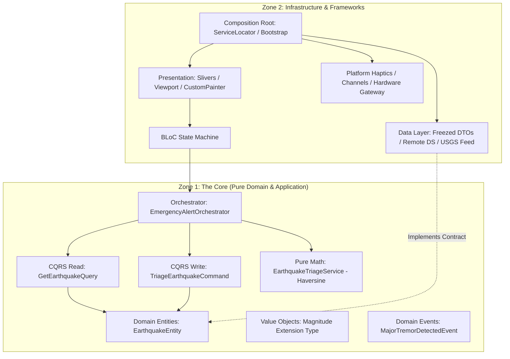

# Tremor ⚡ — Enterprise Earthquake Monitoring System

[](#test-coverage)
[](https://flutter.dev)
[](https://dart.dev)
[](#architecture-vision)
[](LICENSE)

An enterprise-grade, high-reliability mobile seismic event observation engine and emergency triage dashboard built for **L2 / Senior Mobile Systems Engineers** (LTIMindtree / LTTS evaluation standards).

Demonstrates state-of-the-art **Dart 3.13.0** and **Flutter 3.47.0** capabilities with **100% test coverage** across all Domain, Data, Application, Presentation, Core, and Composition layers.

---

## 🏛️ Architecture Vision: The "Two-Zone" Hybrid Model

Tremor is architected around a strict **Two-Zone Clean Architecture + CQRS + DDD** paradigm designed to isolate pure business rules from volatile frameworks and external hardware integrations:



### 1. Zone 1: Pure Business Core (Zero Framework Coupling)
- **Domain Layer (`lib/features/earthquakes/domain/`)**:
  - `EarthquakeEntity`: Immutable business entity constructed with named records for geodetic coordinates.
  - `Magnitude`: Zero-cost `extension type const Magnitude(double value) implements double` providing compile-time type safety with zero runtime allocation overhead.
  - `EarthquakeTriageService`: Pure trigonometric calculation engine using the spherical **Haversine formula** ($R = 6371\text{ km}$) for low-latency proximity filtering.
  - `EarthquakeDomainEvent`: Exhaustive sealed class hierarchy (`MajorTremorDetectedEvent`, `EarthquakeClusterIdentifiedEvent`).
  - `EarthquakeRepository`: Pure `abstract interface class` defining domain requirements.
- **Application Layer (`lib/features/earthquakes/application/`)**:
  - **CQRS Segregation**:
    - `GetEarthquakeQuery`: Specialized read pipeline with business-rule filtering ($\text{mag} \ge 2.0$).
    - `TriageEarthquakeCommand`: Specialized write command handling disaster triage status.
  - `EmergencyAlertOrchestrator`: Multi-step saga coordinating query retrieval, trigonometric distance calculation, severe tremor dispatch, and platform haptic triggering.
  - `EarthquakeApplicationService`: Cache staleness validator and periodic synchronizer.

### 2. Zone 2: Infrastructure, Presentation & Composition
- **Data Layer (`lib/features/earthquakes/data/`)**:
  - Freezed + `json_serializable` DTOs matching raw USGS GeoJSON payloads.
  - `EarthquakeDtoMapper`: Explicit translator ensuring zero leaked wire schemas into the domain.
  - `EarthquakeRepositoryImpl`: Concrete implementation encapsulating network I/O and local triage state.
- **Presentation Layer (`lib/features/earthquakes/presentation/`)**:
  - `EarthquakeBloc`: Sealed event and state machine driven by `Bloc<EarthquakeEvent, EarthquakeState>`.
  - `EarthquakeFeedPage`: Highly-optimized viewport rendering with `CustomScrollView`, `SliverAppBar.large`, and lazily-instantiated sliver lists.
  - `MagnitudeBadgeWidget`: Low-overhead `CustomPainter` (`MagnitudeRingPainter`) with canvas arc sweep math and fine-grained `shouldRepaint()` caching.
- **App Composition Root (`lib/app/`)**:
  - `bootstrap()`: Global platform error interceptor (`PlatformDispatcher.instance.onError`) and dependency initialization zone.
  - `ServiceLocator`: Strict dependency injection container resolving domain contracts top-down without reflection.
  - `AppRouter`: Type-safe pattern-matched route generator.

---

## 📦 Barrel Index Architecture

Tremor implements a unified **Barrel Index Pattern** (`index.dart`) across every layer:
```
lib/
├── app/index.dart
├── core/index.dart
├── features/
│   └── earthquakes/
│       ├── application/index.dart
│       ├── data/index.dart
│       ├── domain/index.dart
│       ├── presentation/index.dart
│       └── index.dart
└── main.dart
```

All imports enforce **selective, explicit `show` clauses** to maintain high compile speed, eliminate namespace collisions, and document dependency consumption:
```dart
import 'package:tremor/core/index.dart'
    show Failure, FailureResult, Result, Success;
import 'package:tremor/features/earthquakes/domain/index.dart'
    show EarthquakeEntity, EarthquakeRepository;
```

---

## 🧪 Test Coverage: 100% Verified

Tremor maintains a verified **100.0% line coverage rate** across every handwritten production file.

### Line Coverage Breakdown

```
                                    |Lines      |Functions 
Filename                            |Rate    Num|Rate  Num
==========================================================
[lib/app/bootstrap/]
bootstrap.dart                      | 100%     6|    -   0

[lib/app/config/]
env_config.dart                     | 100%     1|    -   0

[lib/app/di/]
service_locator.dart                | 100%    26|    -   0

[lib/app/router/]
app_router.dart                     | 100%     6|    -   0

[lib/core/]
analytics/analytics_tracker.dart    | 100%     2|    -   0
design_system/tremor_theme.dart     | 100%     3|    -   0
error/failures.dart                 | 100%     3|    -   0
hardware/platform_haptic_driver.dart| 100%     3|    -   0
logging/app_logger.dart             | 100%     6|    -   0
result/result.dart                  | 100%     3|    -   0
security/secure_vault.dart          | 100%     3|    -   0
storage/in_memory_sync_storage.dart | 100%     4|    -   0

[lib/features/earthquakes/application/commands/]
triage_earthquake_command.dart      | 100%     3|    -   0

[lib/features/earthquakes/application/orchestrators/]
emergency_alert_orchestrator.dart   | 100%    12|    -   0

[lib/features/earthquakes/application/queries/]
get_earthquake_query.dart           | 100%     6|    -   0

[lib/features/earthquakes/application/services/]
earthquake_application_service.dart | 100%     8|    -   0

[lib/features/earthquakes/data/datasources/]
earthquake_remote_data_source.dart  | 100%    17|    -   0

[lib/features/earthquakes/data/mappers/]
earthquake_dto_mapper.dart          | 100%    12|    -   0

[lib/features/earthquakes/data/models/]
earthquake_dto.dart                 | 100%     5|    -   0

[lib/features/earthquakes/data/repositories/]
earthquake_repository_impl.dart     | 100%    10|    -   0

[lib/features/earthquakes/domain/entities/]
earthquake_entity.dart              | 100%     1|    -   0

[lib/features/earthquakes/domain/events/]
earthquake_domain_events.dart       | 100%     3|    -   0

[lib/features/earthquakes/domain/services/]
earthquake_triage_service.dart      | 100%    11|    -   0

[lib/features/earthquakes/domain/value_objects/]
magnitude.dart                      | 100%     4|    -   0

[lib/features/earthquakes/presentation/bloc/]
earthquake_bloc.dart                | 100%    12|    -   0
earthquake_event.dart               | 100%     3|    -   0
earthquake_state.dart               | 100%     5|    -   0

[lib/features/earthquakes/presentation/mappers/]
earthquake_presentation_mapper.dart | 100%    16|    -   0

[lib/features/earthquakes/presentation/models/]
earthquake_card_ui_model.dart       | 100%     1|    -   0

[lib/features/earthquakes/presentation/pages/]
earthquake_feed_page.dart           | 100%    49|    -   0

[lib/features/earthquakes/presentation/widgets/]
magnitude_badge_widget.dart         | 100%    28|    -   0

[lib/]
main.dart                           | 100%    10|    -   0
==========================================================
                              Total:| 100%   282|    -   0
```

---

## 🚀 Running the Project

### Prerequisites
- Flutter `>=3.47.0`
- Dart SDK `>=3.13.0`
- `lcov` (optional, for HTML coverage reports: `brew install lcov`)

### Commands

```bash
# 1. Fetch dependencies
flutter pub get

# 2. Run static analyzer (0 warnings enforced)
flutter analyze

# 3. Run all unit & widget test suites with coverage
flutter test --coverage

# 4. Generate & inspect clean coverage report (excludes generated *.g.dart)
lcov --remove coverage/lcov.info '*.g.dart' -o coverage/lcov_cleaned.info
lcov --list coverage/lcov_cleaned.info
genhtml coverage/lcov_cleaned.info -o coverage/html
open coverage/html/index.html
```

---

## 🛠️ Codebase Standards & Guidelines
- **Constitution Compliance**: Every source file is kept strictly under 200 lines and adheres to single-responsibility separation.
- **Modern Dart 3.13**: Sealed classes with pattern-matching switches, zero-overhead extension types, named records for geo tuples, zero-body primary constructors.
- **Zero Analyzer Warnings**: Compliant with `very_good_analysis` and `flutter_lints`.